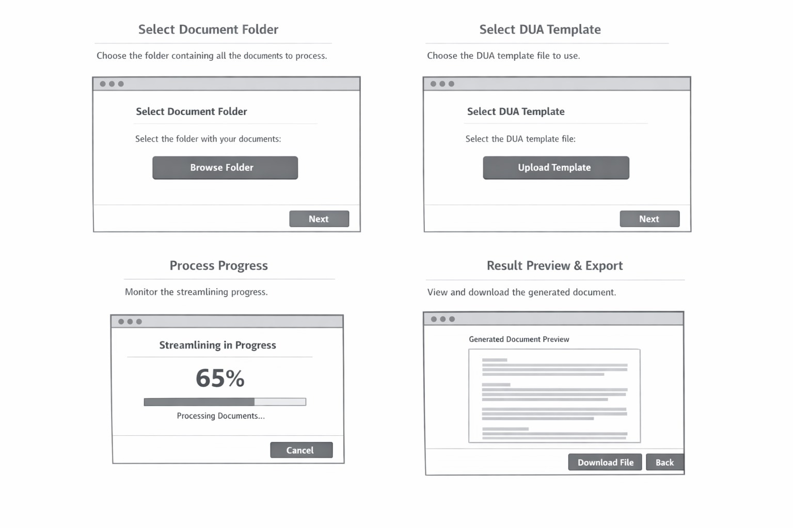

# Caso-1-Diseno
--Authors--
Johel Arias Castillo
Josue Gerardo Calderon Segura

The DUA Streamliner is designed as an automated system to significantly simplify the preparation of the customs declaration form (DUA) for importers and exporters. The user only provides a folder path containing various document types—such as Excel files, Word documents, PDFs, and scanned images—without needing to follow rigid formatting rules. The system is capable of interpreting heterogeneous document structures and extracting relevant information regardless of layout differences.

The core approach relies on a multi-layered intelligent processing method. It performs multi-format reading using document parsers and advanced OCR for scanned files, then applies AI-driven semantic extraction trained in customs terminology. Instead of relying solely on keyword matching, the system uses contextual interpretation to identify critical data such as importer/exporter details, invoice numbers, Incoterms, FOB/CIF values, tariff descriptions, country of origin, and applicable customs regimes, even when documents vary in structure and wording.

The expected solution is the automatic mapping of extracted data into the official DUA template defined by the Ministry of Finance. The system validates basic consistency (such as totals, currencies, and dates), flags ambiguous fields, and generates a pre-filled Word document with visual confidence indicators (green, yellow, red). Rather than replacing customs experts, the system transforms their role into strategic validators, significantly reducing manual operational workload while maintaining regulatory accuracy.

## 1.1 Technology stack:

Frontend technology, security technology, third-party libraries, frameworks, hosting; all with their respective versions

-Application type: Web app
-Web framework: reactjs version 19.2
-Web server: NodeJs version 21
-Coding Languaje: Typescript 5.9.3
-Data validation framework: Zod 4.3.6
-Code prettier framework: Prettier 3.8.1
-Code style framework :eslint 10.0.2
-Unit testing: Jest 30.2.0
-Integration testing: Playwright version 1.58.2
-Cloud service: Azure cloud services
-Hosted by Azure app Service
-Code repository with Azure DevOps
-Automated code tasks by Husky 9.1.7
-CI CD: Azure pipelines
-Environments: development, stage and production
-Enviroment deployments Azure DevOps environments
-Observability by Azure Application Insights SDK

## 1.2 UX UI analysis:

Core business processes:

[Login]
-The user inputs his login, password and the one time token
-When trying to log in, if it fails, an error message shows up
-If it succeds, the user is redirected to the home page
[Streamliner Setup]
-The user selects a file from their device to use as the DUA template
-The user selects a folder from their device which contains all the documents to feed the streamliner
-The user then starts the streamliner, which makes appear the Progress tracking loading window
[Progress tracking]
-Shows a percentage along with a progress bar that show the overall state of the process
[Result obtention  / export]
-Shows the user a preview of the word document
-The user can them download the dile directly to his device 
[Logout]
-The user is logged out from the app and redirected to the login page

[Wireframes]

UX test results

## 1.3 Component design strategy:

Defines the technique and principles for frontend component design, how component reusability is achieved, how styles are centralized, and how branding, internationalization, and responsiveness are implemented.

## 1.4 Security:

Technologies, techniques, and classes with their respective location in the project structure responsible for authentication and authorization of permissions and sessions.

## 1.5 Layered design:

Design and explanation of the different layers of the application in the frontend.

## 1.6 Design patterns:

Design of classes with their respective location in the project structure, where it is necessary to apply object-oriented design patterns, such as: security, UI refresh, notification reception, state storage, API calls, asynchronous operations, session invalidation, event-driven programming, object creation.

## 1.7

A folder in /src that contains the project scaffold, which is generated based on the full specification of points 1.1 through 1.6.

