# Caso-1-Diseno
--Authors--
Johel Arias Castillo
Josue Gerardo Calderon Segura

The DUA Streamliner is designed as an automated system to significantly simplify the preparation of the customs declaration form (DUA) for importers and exporters. The user only provides a folder path containing various document types—such as Excel files, Word documents, PDFs, and scanned images—without needing to follow rigid formatting rules. The system is capable of interpreting heterogeneous document structures and extracting relevant information regardless of layout differences.

The core approach relies on a multi-layered intelligent processing method. It performs multi-format reading using document parsers and advanced OCR for scanned files, then applies AI-driven semantic extraction trained in customs terminology. Instead of relying solely on keyword matching, the system uses contextual interpretation to identify critical data such as importer/exporter details, invoice numbers, Incoterms, FOB/CIF values, tariff descriptions, country of origin, and applicable customs regimes, even when documents vary in structure and wording.

The expected solution is the automatic mapping of extracted data into the official DUA template defined by the Ministry of Finance. The system validates basic consistency (such as totals, currencies, and dates), flags ambiguous fields, and generates a pre-filled Word document with visual confidence indicators (green, yellow, red). Rather than replacing customs experts, the system transforms their role into strategic validators, significantly reducing manual operational workload while maintaining regulatory accuracy.

# FRONTEND DESIGN
## 1.1 Technology stack

Frontend technology, security technology, third-party libraries, frameworks, hosting; all with their respective versions

- Application type: Web app
- Web framework: reactjs version 19.2
- Web server: NodeJs version 21
- Coding Languaje: Typescript 5.9.3
- Data validation framework: Zod 4.3.6
- Code prettier framework: Prettier 3.8.1
- Code style framework :eslint 10.0.2
- Unit testing: Jest 30.2.0
- Integration testing: Playwright version 1.58.2
- Cloud service: Azure cloud services
- Hosted by Azure app Service
- Code repository with Azure DevOps
- Automated code tasks by Husky 9.1.7
- CI CD: Azure pipelines
- Environments: development, stage and production
- Enviroment deployments Azure DevOps environments
- Observability by Azure Application Insights SDK

## 1.2 UX UI analysis

Core business processes:

**Login**
- The user inputs his login, password and the one time token
- When trying to log in, if it fails, an error message shows up
- If it succeds, the user is redirected to the home page
  
**Streamliner Setup**
- The user selects a file from their device to use as the DUA template
- The user selects a folder from their device which contains all the documents to feed the streamliner
- The user then starts the streamliner, which makes appear the Progress tracking loading window
  
**Progress tracking**
- Shows a percentage along with a progress bar that show the overall state of the process

**Result obtention  / export**
- Shows the user a preview of the word document
- The user can them download the file directly to his device
  
**Logout**
- The user is logged out from the app and redirected to the login page

Wireframes

## UX test results

Heatmaps

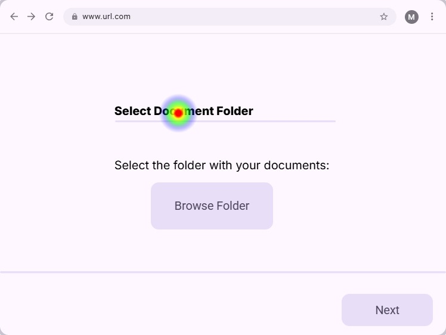
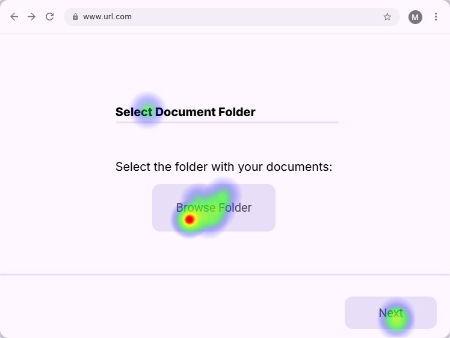
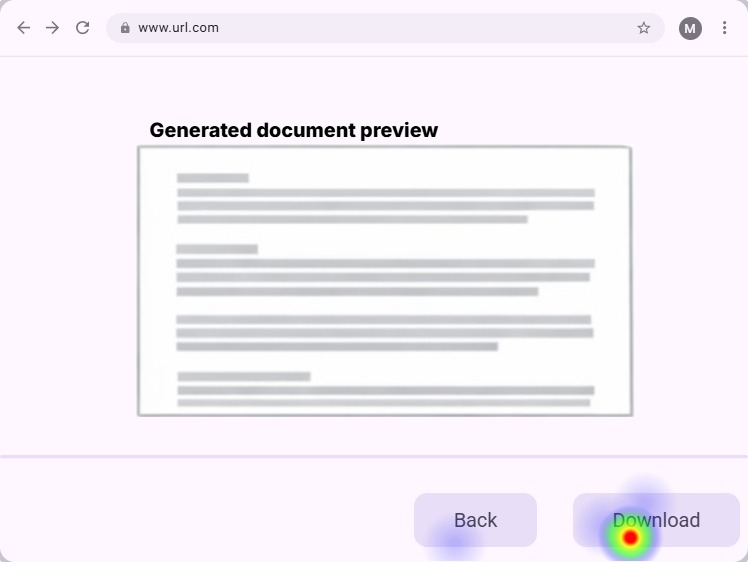
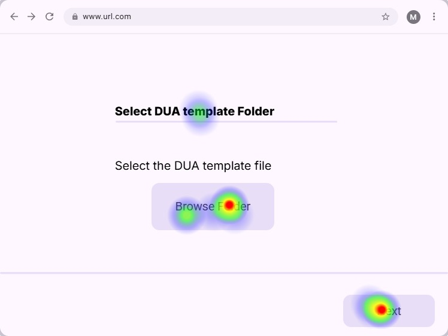

Capturas de los testers

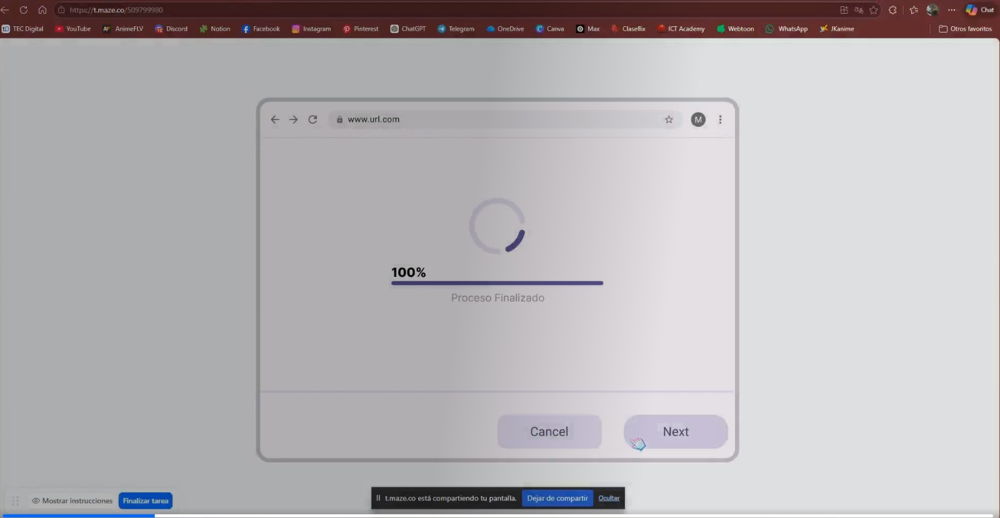
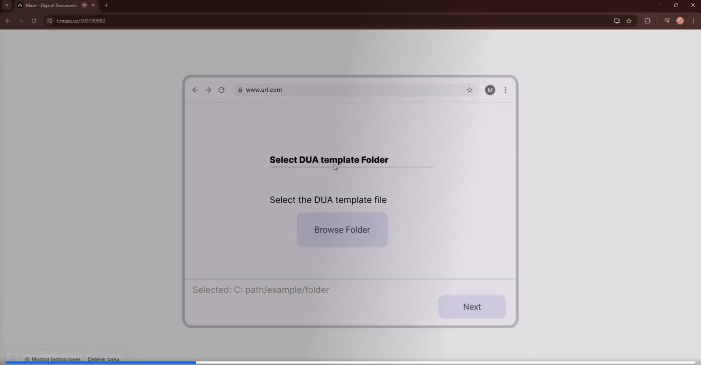
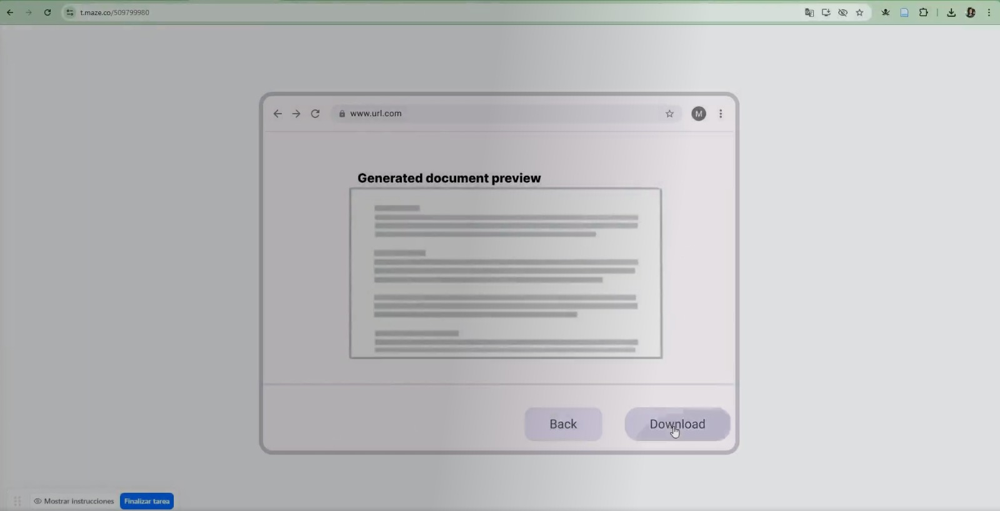

## 1.3 Component design strategy

- Use atomic design for basic and complex component design
- Centralize CSS styles in just one file per component type
- Class names patterns for CSS: ComponentName-StyleName
- Use only "em" positional units to support responsiveness in the design
- Components supports react-i18next 16.5.8
- There're not accesible requirements
- Apply separation of concerns using container and presentational components
- Establish a centralized design system with reusable design tokens
- Implement domain-driven components tailored to DUA workflows
- Standardize UI states (loading, error, empty, success) across components
- Use lazy loading and code splitting for performance optimization
- Introduce reusable validated form components integrated with Zod
- Implement component-level error boundaries

## 1.4 Security:

Technologies, techniques, and classes with their respective location in the project structure responsible for authentication and authorization of permissions and sessions.

- Multi-Factor Authentication (MFA) through Azure Entra ID.
- Mobile authenticator application only.
- Single Sign on Azure Entra ID
- Authentication is handled by Azure Entra ID.
- Roles: Manager, Customs Agent
- **Permissions by Role**
  - **Manager**
    - Permission Code: MANAGE_USERS
      - Description: Manage users with crud operations
  - Permission Code: VIEW_REPORTS
    + Description: Access operational and performance reports.
  + Permission Code: VIEW_LOGA
    + Description: Access processes logs and reports.
  - **Customs Agent**
    + Permission Code: LOAD_FILE_FOLDER
      + Description: Set and upload a folder with data files.
    + Permission Code: LOAD_TEMPLATE
      + Description: Set and upload a file for the DUA template
    + Permission Code: GENERATE_DUA
      + Description: Starts the AI process of generating a DUA
    + Permission Code: PREVIEW_DUA
      + Description: showa a previe of the generated DUA 
    + Permission Code: DOWNLOAD_DUA
      + Description: Downloads the generated DUA
- Azure Key Vault is used to store Environment variables, API keys, Sensitive configuration data
- Server Name: DuaFrontendServer

## 1.5 Layered design:
- The frontend performs SSR (Server-Side Rendering).
- If there is no authenticated session, the Authentication Layer is invoked.
- If authentication is successful, the visual resource is accessed and rendered within the Components Layer.
- Components follow Atomic Design (atoms, molecules, organisms, templates, and pages); within components, a Hooks Layer exists to connect visual component actions with the Services Layer.
- Services contain the application's operations. Business logic classes
- To perform their tasks, Services may require access to the Utils, ApiClients, and Settings layers.
- ApiClients contains all classes that access external APIs.
- Settings accesses environment variables in Azure Key Vault during rendering.
- ApiClients reads API keys and URLs from Settings.
- All ApiClient calls and returns use classes in Models, which are validated by the DataValidation layer.
- All layers can access the Models, Utils, and State Management layers.
- The NotificationService layer allows other layers to subscribe to events via callback URLs.
- Asynchronous API calls are always handled via callback using the Notification Service layer.
- The Logs layer provides classes to register system events, which are sent via ApiClients.
- ExceptionHandling layer is a shared layer
- ApiClients → External APIs External APIs → Notification Service (Callbacks)
- Shared Layers: Models Zod Validation Redux State Management Exception Handling Logs → Azure Application Insights
- CI/CD: Azure DevOps Repo → Pipelines → Dev / Stage / Prod → Azure App Service
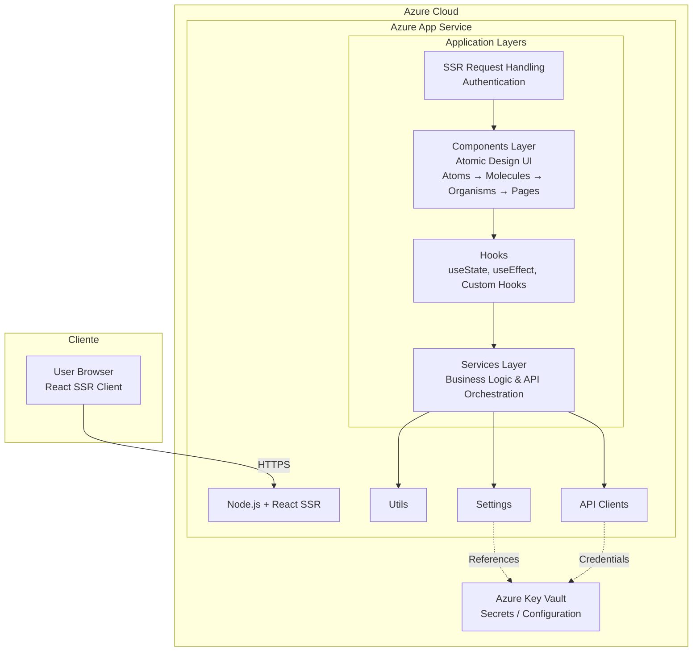

## 1.6 Design patterns:

- Use *Builder Pattern* and *Strategy Pattern* to create the diffrent document processors such as wordx, xlsx, pdf, jpg, png.
- NotificationService subscriptions works with *Observer pattern*
- Use *Adapter pattern* to decide the output format to be writen in the documents, use FormatAdapters y Concret Format such as: Paragraph, Bullets, Table, Label, Amount.
- *Singleton* for: ExceptionHandling, Document Parsers, Utils, StateManagement, The Api Clients, Settings classes.

1.7 Project scaffold

- [components/](./src/components/): Implements the UI following Atomic Design principles defined in [Component Design Strategy](#13-component-design-strategy)
 and UX flows from [UX Analys](#12-UX-UI-analysis)
- [hooks/](./src/hooks/): Acts as the connection layer between UI and business logic as described in [UX Analys](#12-UX-UI-analysis)
- [services/](./src/services/): Contains business logic and use cases aligned with patterns defined in [Design Pattern](#16-Design-patterns)
- [apiClients/](./src/apiClients/): Handles communication with external services as defined in [Layered designs](#15-layered-design)
 and configured in [Technology Stack](#11-Technology-stack)
- [models/](./src/models/): Defines shared data structures used across all layers as described in [Layered designs](#15-layered-design)
- [state/](./src/state/): Centralized state management aligned with shared layers in [Layered designs](#15-layered-design)
- [notification/](./src/notification/): Implements event-driven communication using Observer pattern as defined in [Design Pattern](#16-Design-patterns)
- [exception/](./src/excption/): Centralized error handling using Singleton pattern as defined in [Design Pattern](#16-Design-patterns)
- [logs/](./src/logs/): Handles system observability and integrates with Azure Application Insights as defined in [Technology Stack](#11-Technology-stack)
- [settings/](./src/settings/): Manages environment variables and secure configuration from Azure Key Vault as defined in [Security](#14-Security)
- [utils/](./src/utils/): Provides reusable helper functions shared across layers as described in [Layered designs](#15-layered-design)
- [tests/](./src/tests/): Contains unit and integration tests aligned with tools defined in [Technology Stack](#11-Technology-stack)

# BACKEND DESIGN

## Overview
DUA (Declaración Única Aduanal) Streamliner Backend API built with ASP.NET Core, designed to process and validate customs declaration documents.

## Technology stack
- REST API, HTTPS
- Azure API Management + Azure App Service
- API standard with Open API
- For asyncronous operations and notifications use Azure Notification Hubs
- No load balance required
- API coding language .NET, ASP.NET Core
- This is a monorepo solution, sharing the repository with the frontend, backend folder: duabusiness
- Azure SQL Database

## Security
(Same as frontend:)
- Multi-Factor Authentication (MFA) through Azure Entra ID.
- Mobile authenticator application only.
- Single Sign on Azure Entra ID
- Authentication is handled by Azure Entra ID.
- Roles: Manager, Customs Agent
- **Permissions by Role**
  - **Manager**
    - Permission Code: MANAGE_USERS
      - Description: Manage users with crud operations
  - Permission Code: VIEW_REPORTS
    + Description: Access operational and performance reports.
  + Permission Code: VIEW_LOGA
    + Description: Access processes logs and reports.
  - **Customs Agent**
    + Permission Code: LOAD_FILE_FOLDER
      + Description: Set and upload a folder with data files.
    + Permission Code: LOAD_TEMPLATE
      + Description: Set and upload a file for the DUA template
    + Permission Code: GENERATE_DUA
      + Description: Starts the AI process of generating a DUA
    + Permission Code: PREVIEW_DUA
      + Description: showa a previe of the generated DUA 
    + Permission Code: DOWNLOAD_DUA
      + Description: Downloads the generated DUA
- Azure Key Vault is used to store Environment variables, API keys, Sensitive configuration data
- Server Name: DuaBackendServer

- HTTPS 
- AES-256 for db Encryption
- request payload limited to 2 MiB.
- 60 requests/min per user
- 20 simultaneous connections max
- Archive data after 180 days

## Observability
- Events to register:
  - Login and Logouts
  - file folder loading
  - DUA template loading
  - Dua Generations
  - Dua downloads
- Azure Monitor + Application Insights for tracking and dashboard generation
- Azure Pipelines to automate workflows
- Deployment dev, stage and prod with Azure Pipelines

## Availability
- 8.76 hours anual downtime max
- 99.9% uptime (3 nines)
- SPOF:
 - Azure App Service: 99.95% uptime
 - Azure API Management (APIM) 99.9% uptime
 - Azure Notification Hubs ≥99.9% uptime

## Scalability
- Elements that scale alongside RPM:
 - Azure API Management: scale units, CPU
 - Azure App Service: CPU, TAM, threads, sockets, instances
 - Logs: request logs, traces, exceptions, metrics
 - DB

## Backend key workflows
**1. Upload Files to Generate DUA**
1. The backend receives the request from the authenticated Customs Agent containing the list of files to be uploaded.
2. The API validates:
   - User authentication through Azure Entra ID
   - User permission: LOAD_FILE_FOLDER
   -  Request size limit (max 2 MiB per request)
   - Allowed file types (.pdf, .docx, .xlsx, .jpg, .png, .tiff, .txt)
3. The backend opens a streaming upload session to process files one by one without loading all content into memory.
4. Each file is transferred in raw binary stream format through HTTPS.
5. The backend performs basic file validation:
   - file integrity
   - malware scan hook
   -  duplicate detection
   - unsupported format validation
6. Each valid file is stored in Azure Blob Storage inside a container associated with the current DUA generation request.
7. Metadata is stored in the database:
   - file name
   -  file type
   - upload timestamp
   - storage URI
   - uploaded by user
   - process status
   - correlation ID
8. An event log is registered in Application Insights:
   - upload started
   - upload completed
   - upload failed
9. The backend returns a Folder Upload Session ID that will be used in the DUA generation workflow.

**2. Setup DUA Template**
1. The backend receives the DUA template file upload request.
2. The API validates:
   - authenticated user
   - permission: LOAD_TEMPLATE
   - valid Word template format (.docx)
3. The template file is uploaded using streaming transfer.
4. The file is stored in Azure Blob Storage under a dedicated template container.
5. The backend extracts the Word placeholders / merge fields from the template.
6. The API returns Template Session ID

**3. Generate DUA Document**
1. The backend receives the generation request with:
   - Folder Upload Session ID
   - Template Session ID
2. The API validates:
   - authenticated user
   - permission: GENERATE_DUA
3. A DUA Generation Job is created in the database with status PENDING.
4. The backend sends an asynchronous processing event to the AI processing service.
5. The AI pipeline starts processing:
   - reads all uploaded files from Blob Storage
   - extracts structured text from Excel / Word
   - extracts text from PDFs
   - applies OCR for scanned images and invoices
   - normalizes extracted content
6. The AI semantic engine interprets customs-related fields
7. Extracted data is mapped into the official DUA field model.
8. Validation rules are executed:
   - required fields
   - data format validation
   - cross-field consistency
   - duplicate invoice detection
   - missing values
   -  confidence threshold rules
9. Low-confidence fields are marked with review flags.
10. The Word DUA document is automatically pre-filled using the template.
11. The generated document is stored in Blob Storage.
12. The job status is updated to:
   - COMPLETED
   - FAILED
   - REVIEW_REQUIRED
13. A notification is sent through Azure Notification Hubs.
14. The event is logged in observability tools.

**4. Preview Generated DUA**
1. The backend receives the preview request.
2. The API validates:
   - authenticated user
   - permission: PREVIEW_DUA
3. The backend retrieves the generated DUA file from Blob Storage.
4. The Word file is converted into preview format:
   - PDF
   - HTML rendering
   - document snapshot
5. Confidence indicators are injected visually:
   - green = high confidence
   - yellow = medium confidence
   - red = requires manual review
6. The preview file is returned to the frontend.
7. Preview access is logged.

**5. Download Final DUA**
1. The backend receives the download request.
2. The API validates:
   - authenticated user
   - permission: DOWNLOAD_DUA
3. The backend retrieves the final approved document from Blob Storage.
4.  A secure temporary download URL is generated.
5. The file is returned as a downloadable HTTPS response.
6. Download event is logged.

## Architecture diagrams in layers

### C4 Model – System Context Diagram (Level 1)
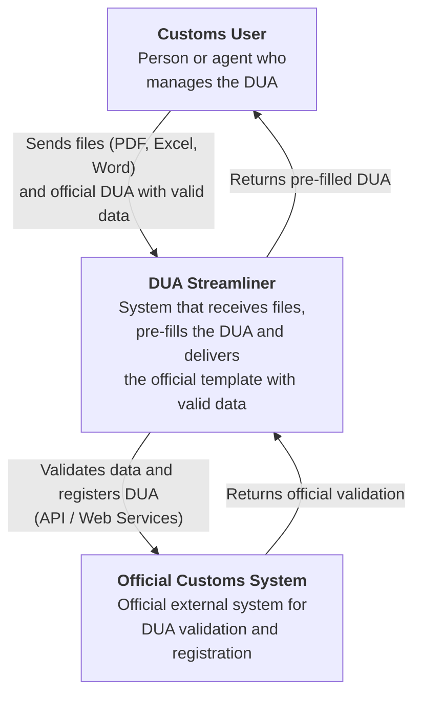

### C4 Model – Container Diagram (Level 2)
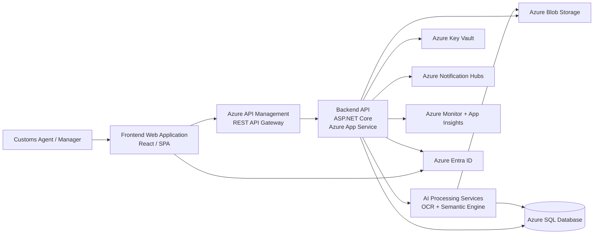
### C4 Model – Code Diagram (Level 4)

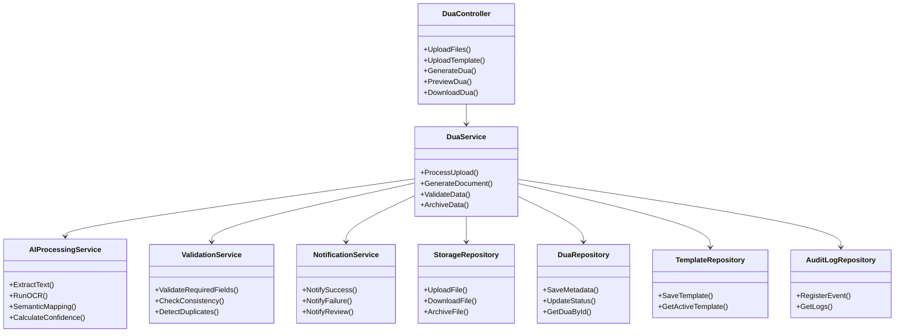

## Design Considerations
### <<<1. System Configurations, Parameters, and Policies>>>
**Configuration Management**
Configuration values must be managed using:
- environment-specific configuration files
- Azure App Service Application Settings
- Azure Key Vault for sensitive values

**Environment Profiles**
Separate configurations must be maintained for:
- development
- staging
- production

**Policy Definitions**
Operational policies must be explicitly defined in code and infrastructure configuration:
- authentication policy via Azure Entra ID
- authorization policy by role and permission codes
- rate limiting policy
- - 60 requests/minute per user
- request size policy
 - max 2 MiB
- data retention policy
  - archive after 180 days
- retry and circuit breaker policies
- secure transport policy
 -HTTPS only
- logging and monitoring policy

### <<<2. Resource Allocations>>>
**Azure API Management (APIM)**
initial allocation:
- tier: Standard
- 1 scale unit initially
- automatic scaling enabled for RPM growth
- request throttling policies enabled

Key parameters:
- CPU utilization threshold: 70%
- request queue threshold: 500
- timeout: 30 seconds

**Azure App Service**
backend allocation:
- App Service Plan Standard S2
- 2 vCPU
- 3.5 GB RAM
- autoscaling based on CPU and queue length

scaling rules:
- scale out when CPU > 70% for 5 minutes
- scale in when CPU < 30% for 10 minutes
- max instances: 5
- min instances: 1

**Storage**
For document processing:
- Azure Blob Storage
- Hot tier for active files
- Cool/Archive tier after 180 days

limits:
- container segmentation by tenant/process
- max file count per request
- versioning enabled

**Database**
resource allocation:
- Azure SQL Database
- encrypted with AES-256
- automatic backup enabled
- geo-redundant backup recommended

Store:
- metadata
- workflow states
- logs references
- confidence scores
- user activity records

**Networking Parameters**
Define:
- HTTPS port
- API gateway endpoint
- VNet integration if required
- private endpoint for Key Vault and storage
- firewall IP restrictions
- CORS policy

### <<<3. Core Business Logic Algorithms and Parameters>>>
**Document Classification Algorithm**
Purpose: Automatically identify file type and business relevance.
Parameters:
- confidence threshold
- minimum text length
- OCR fallback enabled

**OCR Extraction Algorithm**
- Azure AI Document Intelligence / OCR
Parameters:
- language model
- scanned image resolution threshold
- confidence threshold

**Semantic Mapping Algorithm**
Purpose: Map extracted fields into DUA schema.
- NLP entity extraction
- semantic matching
- customs terminology ontology
Parameters:
- entity confidence threshold
- field synonym dictionary
- customs code dictionary
- fuzzy match tolerance

**Validation Rules Engine**
Rule-based validation engine for:
- required fields
- tax ID format
- invoice totals consistency
- quantity validation
- customs code validation
### <<<4. Agent Prototypes Definition>>>
**File Ingestion Agent**
Responsible for:
- receiving uploaded files
- validating formats
- storing files
- generating metadata

**OCR Processing Agent**
Responsible for:
- scanned document detection
- image preprocessing
- OCR extraction
- confidence scoring

**Semantic Interpretation Agent**
Responsible for:
- customs terminology recognition
- field extraction
- entity normalization
- business semantic mapping

**DUA Generation Agent**
Responsible for:
- template loading
- field replacement
- confidence indicators
- output document generation

**Validation Agent**
Responsible for:
- consistency checks
- business rules
- anomaly detection
- manual review flags

**Notification Agent**
Responsible for:
- process status updates
- async completion notifications
- failure alerts

### <<<5. Interfaces, Proxies, and Integration Points>>>
**Frontend-Backend Interface**
Protocol:
- REST API
- HTTPS
- OpenAPI documented endpoints

**Backend-Azure Blob Storage**
Integration via:
- Azure SDK proxy layer
- storage service abstraction interface

**Backend-AI/OCR Services**
-Proxy interface

**Backend-Notification Hubs**
-Proxy interface

**Backend-Identity Provider**
Integration point:
- Azure Entra ID
- OAuth2 / OpenID Connect

**Backend-Monitoring Systems**
Integration:
- Azure Monitor
- Application Insights

Metrics:
- latency
- throughput
- failures
- retry count
- AI confidence averages

## Project Structure

### [Controllers/](Backend/duabusiness/Controllers/)
REST API endpoints for:
- [FileUploadController](Backend/duabusiness/Controllers/FileUploadController.cs): File ingestion and management
- [TemplateController](Backend/duabusiness/Controllers/TemplateController.cs): DUA template management
- [DuaGenerationController](Backend/duabusiness/Controllers/DuaGenerationController.cs): Document generation orchestration
- [DuaDocumentController](Backend/duabusiness/Controllers/DuaDocumentController.cs): Preview and download operations
- [UserManagementController](Backend/duabusiness/Controllers/UserManagementController.cs): User CRUD operations (Manager only)
- [ReportController](Backend/duabusiness/Controllers/ReportController.cs): Analytics and reporting (Manager only)
- [AuthenticationController](Backend/duabusiness/Controllers/AuthenticationController.cs): Session and token management

### [Services/](Backend/duabusiness/Services/)
Business logic layer:
- [FileUploadService](Backend/duabusiness/Services/FileUploadService.cs): File handling and validation
- [TemplateService](Backend/duabusiness/Services/TemplateService.cs): Template processing
- [DuaGenerationService](Backend/duabusiness/Services/DuaGenerationService.cs): Generation orchestration
- [DuaDocumentService](Backend/duabusiness/Services/DuaDocumentService.cs): Document rendering
- [ValidationService](Backend/duabusiness/Services/ValidationService.cs): Data validation
- [NotificationService](Backend/duabusiness/Services/NotificationService.cs): Event notifications
- [AuditService](Backend/duabusiness/Services/AuditService.cs): Audit logging
- [UserManagementService](Backend/duabusiness/Services/UserManagementService.cs): User operations
- [ReportService](Backend/duabusiness/Services/ReportService.cs): Analytics
- [AuthenticationService](Backend/duabusiness/Services/AuthenticationService.cs): Auth handling

### [Models/](Backend/duabusiness/Models/)
Data entities:
- [User](Backend/duabusiness/Models/User.cs), [FileMetadata](Backend/duabusiness/Models/FileMetadata.cs), [FileUploadSession](Backend/duabusiness/Models/FileUploadSession.cs), [TemplateSession](Backend/duabusiness/Models/TemplateSession.cs)
- [DuaGenerationJob](Backend/duabusiness/Models/DuaGenerationJob.cs), [DuaData](Backend/duabusiness/Models/DuaData.cs), [AuditLog](Backend/duabusiness/Models/AuditLog.cs)
- [ValidationRule](Backend/duabusiness/Models/ValidationRule.cs), [OCRExtractionResult](Backend/duabusiness/Models/OCRExtractionResult.cs), [SemanticMappingResult](Backend/duabusiness/Models/SemanticMappingResult.cs)
- [NotificationMessage](Backend/duabusiness/Models/NotificationMessage.cs)

### [Repositories/](Backend/duabusiness/Repositories/)
Data access layer with Entity Framework Core:
- [IRepository](Backend/duabusiness/Repositories/IRepository.cs): Generic Repository pattern
- [FileUploadSessionRepository](Backend/duabusiness/Repositories/FileUploadSessionRepository.cs), [FileMetadataRepository](Backend/duabusiness/Repositories/FileMetadataRepository.cs)
- [TemplateSessionRepository](Backend/duabusiness/Repositories/TemplateSessionRepository.cs), [DuaGenerationJobRepository](Backend/duabusiness/Repositories/DuaGenerationJobRepository.cs)
- [DuaDataRepository](Backend/duabusiness/Repositories/DuaDataRepository.cs), [UserRepository](Backend/duabusiness/Repositories/UserRepository.cs)
- [AuditLogRepository](Backend/duabusiness/Repositories/AuditLogRepository.cs), [ValidationRuleRepository](Backend/duabusiness/Repositories/ValidationRuleRepository.cs)
- [OCRExtractionResultRepository](Backend/duabusiness/Repositories/OCRExtractionResultRepository.cs), [SemanticMappingResultRepository](Backend/duabusiness/Repositories/SemanticMappingResultRepository.cs)
- [NotificationMessageRepository](Backend/duabusiness/Repositories/NotificationMessageRepository.cs)

### [ApiClients/](Backend/duabusiness/ApiClients/)
External service integrations:
- [AzureBlobStorageClient](Backend/duabusiness/ApiClients/AzureBlobStorageClient.cs): File storage
- [AzureOcrClient](Backend/duabusiness/ApiClients/AzureOcrClient.cs): OCR processing
- [AzureNotificationHubsClient](Backend/duabusiness/ApiClients/AzureNotificationHubsClient.cs): Push notifications
- [AzureKeyVaultClient](Backend/duabusiness/ApiClients/AzureKeyVaultClient.cs): Secrets management
- [AzureApplicationInsightsClient](Backend/duabusiness/ApiClients/AzureApplicationInsightsClient.cs): Telemetry
- [DocumentProcessingClient](Backend/duabusiness/ApiClients/DocumentProcessingClient.cs): Document parsing
- [MalwareScanClient](Backend/duabusiness/ApiClients/MalwareScanClient.cs): Security scanning

### [Agents/](Backend/duabusiness/Agents/)
Processing orchestration (Agent pattern):
- [FileIngestionAgent](Backend/duabusiness/Agents/FileIngestionAgent.cs): File validation and ingestion
- [OCRProcessingAgent](Backend/duabusiness/Agents/OCRProcessingAgent.cs): Scanned document processing
- [SemanticInterpretationAgent](Backend/duabusiness/Agents/SemanticInterpretationAgent.cs): Field mapping
- [DuaGenerationAgent](Backend/duabusiness/Agents/DuaGenerationAgent.cs): Document generation
- [ValidationAgent](Backend/duabusiness/Agents/ValidationAgent.cs): Data validation
- [NotificationAgent](Backend/duabusiness/Agents/NotificationAgent.cs): Event notifications

### [Middleware/](Backend/duabusiness/Middleware/)
Cross-cutting concerns:
- [AuthenticationMiddleware](Backend/duabusiness/Middleware/AuthenticationMiddleware.cs): Token validation
- [AuthorizationMiddleware](Backend/duabusiness/Middleware/AuthorizationMiddleware.cs): Permission checking
- [RateLimitingMiddleware](Backend/duabusiness/Middleware/RateLimitingMiddleware.cs): Request throttling (60 req/min)
- [RequestSizeLimitMiddleware](Backend/duabusiness/Middleware/RequestSizeLimitMiddleware.cs): Payload limit (2 MiB)
- [ExceptionHandlingMiddleware](Backend/duabusiness/Middleware/ExceptionHandlingMiddleware.cs): Error handling
- [LoggingMiddleware](Backend/duabusiness/Middleware/LoggingMiddleware.cs): Request/response logging
- [HttpsEnforcementMiddleware](Backend/duabusiness/Middleware/HttpsEnforcementMiddleware.cs): HTTPS only
- [CorsMiddleware](Backend/duabusiness/Middleware/CorsMiddleware.cs): CORS policy

### [Validators/](Backend/duabusiness/Validators/)
Input validation:
- [FileValidator](Backend/duabusiness/Validators/FileValidator.cs): File type and size validation
- [TemplateValidator](Backend/duabusiness/Validators/TemplateValidator.cs): Template format validation
- [DuaDataValidator](Backend/duabusiness/Validators/DuaDataValidator.cs): DUA data consistency
- [UserInputValidator](Backend/duabusiness/Validators/UserInputValidator.cs): User input validation

### [Configuration/](Backend/duabusiness/Configuration/)
System configuration and policies:
- [SystemPolicies](Backend/duabusiness/Configuration/SystemPolicies.cs): Constants and limits
- [RolePermissionMap](Backend/duabusiness/Configuration/RolePermissionMap.cs): Permission matrix
- [AzureResourceConfig](Backend/duabusiness/Configuration/AzureResourceConfig.cs): Azure resource settings
- [AlgorithmConfig](Backend/duabusiness/Configuration/AlgorithmConfig.cs): AI/ML parameters
- [ApplicationSettings](Backend/duabusiness/Configuration/ApplicationSettings.cs): Environment config
- [ServiceRegistration](Backend/duabusiness/Configuration/ServiceRegistration.cs): Dependency injection
- [DatabaseConfig](Backend/duabusiness/Configuration/DatabaseConfig.cs): Database configuration

### [Exceptions/](Backend/duabusiness/Exceptions/)
Custom exception hierarchy:
- [DuaBusinessException](Backend/duabusiness/Exceptions/DuaBusinessException.cs): Base exception and specialized exceptions
  - AuthenticationException, AuthorizationException
  - FileUploadException, ValidationException
  - ProcessingException, ResourceNotFoundException

### [Logs/](Backend/duabusiness/Logs/)
Logging service:
- [LoggingService](Backend/duabusiness/Logs/LoggingService.cs): Application Insights integration

### [Utils/](Backend/duabusiness/Utils/)
Utility functions and extensions:
- [UtilityHelpers](Backend/duabusiness/Utils/UtilityHelpers.cs): String, Collection, DateTime extensions, Crypto and File utilities
