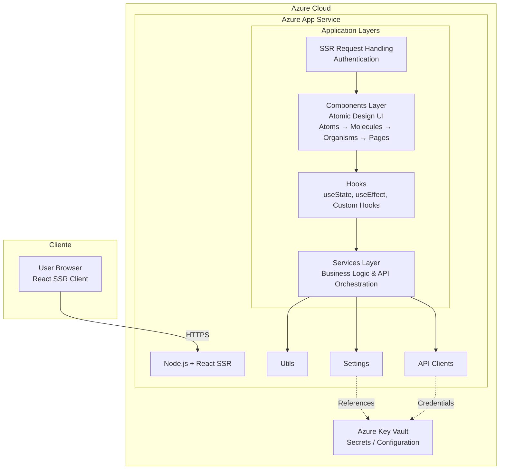

# Caso-1-Diseno
--Authors--
Johel Arias Castillo
Josue Gerardo Calderon Segura

The DUA Streamliner is designed as an automated system to significantly simplify the preparation of the customs declaration form (DUA) for importers and exporters. The user only provides a folder path containing various document types—such as Excel files, Word documents, PDFs, and scanned images—without needing to follow rigid formatting rules. The system is capable of interpreting heterogeneous document structures and extracting relevant information regardless of layout differences.

The core approach relies on a multi-layered intelligent processing method. It performs multi-format reading using document parsers and advanced OCR for scanned files, then applies AI-driven semantic extraction trained in customs terminology. Instead of relying solely on keyword matching, the system uses contextual interpretation to identify critical data such as importer/exporter details, invoice numbers, Incoterms, FOB/CIF values, tariff descriptions, country of origin, and applicable customs regimes, even when documents vary in structure and wording.

The expected solution is the automatic mapping of extracted data into the official DUA template defined by the Ministry of Finance. The system validates basic consistency (such as totals, currencies, and dates), flags ambiguous fields, and generates a pre-filled Word document with visual confidence indicators (green, yellow, red). Rather than replacing customs experts, the system transforms their role into strategic validators, significantly reducing manual operational workload while maintaining regulatory accuracy.

## 1.1 Technology stack

Frontend technology, security technology, third-party libraries, frameworks, hosting; all with their respective versions

- Application type: Web app
- Web framework: reactjs version 19.2
- Web server: NodeJs version 21
- Coding Languaje: Typescript 5.9.3
- Data validation framework: Zod 4.3.6
- Code prettier framework: Prettier 3.8.1
- Code style framework :eslint 10.0.2
- Unit testing: Jest 30.2.0
- Integration testing: Playwright version 1.58.2
- Cloud service: Azure cloud services
- Hosted by Azure app Service
- Code repository with Azure DevOps
- Automated code tasks by Husky 9.1.7
- CI CD: Azure pipelines
- Environments: development, stage and production
- Enviroment deployments Azure DevOps environments
- Observability by Azure Application Insights SDK

## 1.2 UX UI analysis

Core business processes:

**Login**
- The user inputs his login, password and the one time token
- When trying to log in, if it fails, an error message shows up
- If it succeds, the user is redirected to the home page
  
**Streamliner Setup**
- The user selects a file from their device to use as the DUA template
- The user selects a folder from their device which contains all the documents to feed the streamliner
- The user then starts the streamliner, which makes appear the Progress tracking loading window
  
**Progress tracking**
- Shows a percentage along with a progress bar that show the overall state of the process

**Result obtention  / export**
- Shows the user a preview of the word document
- The user can them download the file directly to his device
  
**Logout**
- The user is logged out from the app and redirected to the login page

Wireframes

## UX test results

Heatmaps

Capturas de los testers

## 1.3 Component design strategy

- Use atomic design for basic and complex component design
- Centralize CSS styles in just one file per component type
- Class names patterns for CSS: ComponentName-StyleName
- Use only "em" positional units to support responsiveness in the design
- Components supports react-i18next 16.5.8
- There're not accesible requirements
- Apply separation of concerns using container and presentational components
- Establish a centralized design system with reusable design tokens
- Implement domain-driven components tailored to DUA workflows
- Standardize UI states (loading, error, empty, success) across components
- Use lazy loading and code splitting for performance optimization
- Introduce reusable validated form components integrated with Zod
- Implement component-level error boundaries

## 1.4 Security:

Technologies, techniques, and classes with their respective location in the project structure responsible for authentication and authorization of permissions and sessions.

- Multi-Factor Authentication (MFA) through Azure Entra ID.
- Mobile authenticator application only.
- Single Sign on Azure Entra ID
- Authentication is handled by Azure Entra ID.
- Roles: Manager, Customs Agent
- **Permissions by Role**
  - **Manager**
    - Permission Code: MANAGE_USERS
      - Description: Manage users with crud operations
  - Permission Code: VIEW_REPORTS
    + Description: Access operational and performance reports.
  + Permission Code: VIEW_LOGA
    + Description: Access processes logs and reports.
  - **Customs Agent**
    + Permission Code: LOAD_FILE_FOLDER
      + Description: Set and upload a folder with data files.
    + Permission Code: LOAD_TEMPLATE
      + Description: Set and upload a file for the DUA template
    + Permission Code: GENERATE_DUA
      + Description: Starts the AI process of generating a DUA
    + Permission Code: PREVIEW_DUA
      + Description: showa a previe of the generated DUA 
    + Permission Code: DOWNLOAD_DUA
      + Description: Downloads the generated DUA
- Azure Key Vault is used to store Environment variables, API keys, Sensitive configuration data
- Server Name: DuaFrontendServer

## 1.5 Layered design:
- The frontend performs SSR (Server-Side Rendering).
- If there is no authenticated session, the Authentication Layer is invoked.
- If authentication is successful, the visual resource is accessed and rendered within the Components Layer.
- Components follow Atomic Design (atoms, molecules, organisms, templates, and pages); within components, a Hooks Layer exists to connect visual component actions with the Services Layer.
- Services contain the application's operations. Business logic classes
- To perform their tasks, Services may require access to the Utils, ApiClients, and Settings layers.
- ApiClients contains all classes that access external APIs.
- Settings accesses environment variables in Azure Key Vault during rendering.
- ApiClients reads API keys and URLs from Settings.
- All ApiClient calls and returns use classes in Models, which are validated by the DataValidation layer.
- All layers can access the Models, Utils, and State Management layers.
- The NotificationService layer allows other layers to subscribe to events via callback URLs.
- Asynchronous API calls are always handled via callback using the Notification Service layer.
- The Logs layer provides classes to register system events, which are sent via ApiClients.
- ExceptionHandling layer is a shared layer
- ApiClients → External APIs External APIs → Notification Service (Callbacks)
- Shared Layers: Models Zod Validation Redux State Management Exception Handling Logs → Azure Application Insights
- CI/CD: Azure DevOps Repo → Pipelines → Dev / Stage / Prod → Azure App Service

## 1.6 Design patterns:

- Use *Builder Pattern* and *Strategy Pattern* to create the diffrent document processors such as wordx, xlsx, pdf, jpg, png.
- NotificationService subscriptions works with *Observer pattern*
- Use *Adapter pattern* to decide the output format to be writen in the documents, use FormatAdapters y Concret Format such as: Paragraph, Bullets, Table, Label, Amount.
- *Singleton* for: ExceptionHandling, Document Parsers, Utils, StateManagement, The Api Clients, Settings classes.

1.7 Project scaffold

- [components/](./src/components/): Implements the UI following Atomic Design principles defined in [Component Design Strategy](#13-component-design-strategy)
 and UX flows from [UX Analys](#12-UX-UI-analysis)
- [hooks/](./src/hooks/): Acts as the connection layer between UI and business logic as described in [UX Analys](#12-UX-UI-analysis)
- [services/](./src/services/): Contains business logic and use cases aligned with patterns defined in [Design Pattern](#16-Design-patterns)
- [apiClients/](./src/apiClients/): Handles communication with external services as defined in [Layered designs](#15-layered-design)
 and configured in [Technology Stack](#11-Technology-stack)
- models/: Defines shared data structures used across all layers as described in [Layered designs](#15-layered-design)
- state/: Centralized state management aligned with shared layers in [Layered designs](#15-layered-design)
- notification/: Implements event-driven communication using Observer pattern as defined in [Design Pattern](#16-Design-patterns)
- exception/: Centralized error handling using Singleton pattern as defined in [Design Pattern](#16-Design-patterns)
- logs/: Handles system observability and integrates with Azure Application Insights as defined in [Technology Stack](#11-Technology-stack)
- settings/: Manages environment variables and secure configuration from Azure Key Vault as defined in [Security](#14-Security)
- utils/: Provides reusable helper functions shared across layers as described in [Layered designs](#15-layered-design)
- tests/: Contains unit and integration tests aligned with tools defined in [Technology Stack](#11-Technology-stack)

